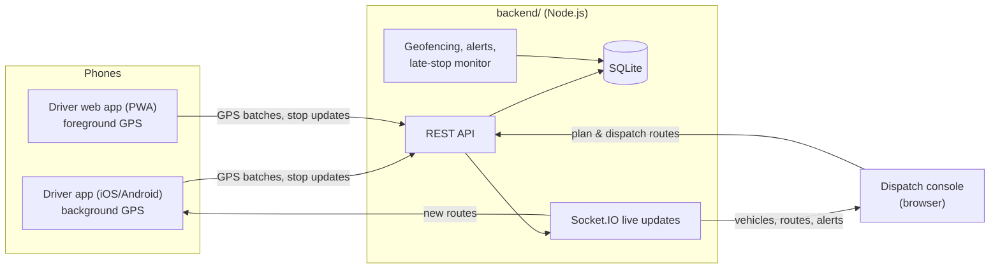

# Fleetline

Fleet management with live GPS tracking, route planning and dispatch, a native driver app with background
location, and delivery analytics.



| Folder | What it is |
|---|---|
| [`backend/`](backend) | Node.js server: REST API, WebSocket updates, SQLite database, dispatch console and driver web app. See [backend/README.md](backend/README.md). |
| [`mobile/`](mobile) | Native driver app (Expo / React Native) with background GPS tracking. See [mobile/README.md](mobile/README.md). |
| [`demo/`](demo) | The original single-file prototype with simulated data. |

## Features

- **Live tracking:** vehicles on a street map, updated every few seconds, with speed, heading, GPS accuracy and breadcrumb trails.
- **Route management:** build routes by clicking delivery places, optimise stop order, follow real roads (OSRM), dispatch to a vehicle, reassign or cancel.
- **Driver app:** shift start/end, background GPS with an offline queue, new-route notifications, navigation hand-off to Google/Apple Maps, delivery notes, skip with reason.
- **Automation:** stops are marked arrived when the vehicle enters a 90 m geofence and completed when it drives away.
- **Alerts:** speeding, late arrivals, routes running behind, skipped stops, phones that stop reporting.
- **Analytics:** on-time rate, deliveries by hour, distance and driving time per vehicle, route performance, by day.

## Quick start

Requires Node.js 22.13+ (24 recommended).

**On Windows:** double-click `start-local.cmd`. It installs packages and demo data on first run, starts the server,
optionally starts simulated drivers and a public https link for your phone, and opens the console.

**Any OS:**

```bash
cd backend
```

```bash
npm install
```

```bash
npm run seed
```

```bash
npm start
```

Open http://localhost:4000 and sign in as `dispatch` / `dispatch123`. To watch vehicles move without phones, run
`npm run simulate -- --speed 6` in a second terminal.

For the native driver app, see [mobile/README.md](mobile/README.md).

## Tests

```bash
cd backend && npm test
```

The test seeds a throwaway database, starts the real server and runs a full dispatch → shift → GPS → geofence
arrival → delivery → analytics cycle. GitHub Actions runs it, plus a typecheck and bundle build of the mobile app,
on every push ([.github/workflows/ci.yml](.github/workflows/ci.yml)).

## Before production

- Set `JWT_SECRET`, and replace the seeded demo accounts and passwords.
- Serve the backend over HTTPS on a host with a persistent disk for `backend/data/`, and back it up.
- Use a commercial map tile provider and your own routing server instead of the free public ones (`backend/.env.example`).
- Set your own iOS bundle ID / Android package name for the mobile app (`mobile/app.config.ts`).
- Tell drivers what is tracked and when (only on shift), and follow local employee-monitoring rules.
