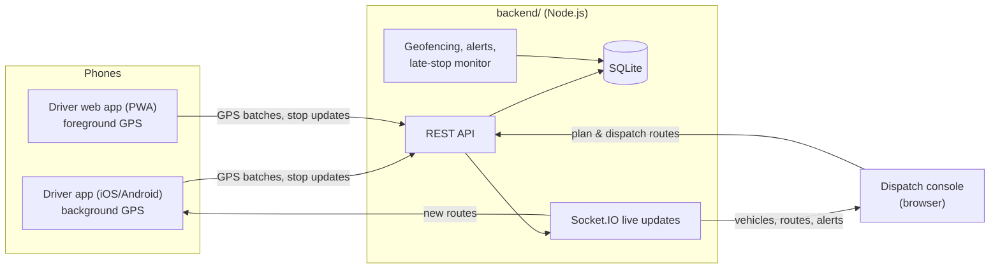

# Fleetline

Fleet management with live GPS tracking, route planning and dispatch, a native driver app with background
location, and delivery analytics.



| Folder | What it is |
|---|---|
| [`backend/`](backend) | Node.js server: REST API, WebSocket updates, SQLite database, dispatch console and driver web app. See [backend/README.md](backend/README.md). |
| [`mobile/`](mobile) | Native driver app (Expo / React Native) with background GPS tracking. See [mobile/README.md](mobile/README.md). |
| [`demo/`](demo) | The original single-file prototype with simulated data. |
| [`docs/architecture/`](docs/architecture) | Architecture pack: the completed architecture and compliance template (22 areas, gates, threat model, privacy, registers, runbooks, decision records). Start with its [README](docs/architecture/README.md). |

## Features

- **Live tracking:** vehicles on a street map, updated every few seconds, with speed, heading, GPS accuracy and breadcrumb trails.
- **Route management:** build routes by clicking delivery places, optimise stop order, follow real roads (OSRM), dispatch to a vehicle, reassign or cancel.
- **Driver app:** shift start/end, background GPS with an offline queue, new-route notifications, navigation hand-off to Google/Apple Maps, delivery notes, skip with reason.
- **Automation:** stops are marked arrived when the vehicle enters a 90 m geofence and completed when it drives away.
- **Alerts:** speeding, late arrivals, routes running behind, skipped stops, phones that stop reporting.
- **Analytics:** on-time rate, deliveries by hour, distance and driving time per vehicle, route performance, by day.
- **Driver sign-up:** drivers request an account from the app; an admin approves them and assigns a truck or van.
- **Performance:** each driver sees their own week vs. 4-week average, weekly rank, 14-day history, route and vehicle condition; admins see the same for every driver and vehicle in the Team tab.
- **Vehicle condition:** pre-trip checks, GPS odometer, service countdown and service records.
- **Security and privacy:**
  - Two-step login (authenticator app) required for staff
  - Audit log
  - A privacy notice drivers accept before any tracking
  - Driver data export and erasure
  - Automatic retention limits
  - Verified daily backups

## Quick start

Requires Node.js 22.13+ (24 recommended).

**On Windows:** double-click `start-local.cmd`. It installs packages and demo data on first run, starts the server,
optionally starts simulated drivers and a public https link for your phone, and opens the console.

**Any OS:**

```bash
cd backend
```

```bash
npm install
```

```bash
npm run seed
```

```bash
npm start
```

Open http://localhost:4000 and sign in as `admin` / `dispatch123`. The first time, the console asks you to set up
**two-step sign-in** with an authenticator app on your phone (Google Authenticator, Microsoft Authenticator, 1Password…).
For a quick local demo only, you can switch this off with `REQUIRE_STAFF_MFA=false` in `backend/.env`.

To watch vehicles move without phones, run `npm run simulate -- --speed 6` in a second terminal.

For the native driver app, see [mobile/README.md](mobile/README.md).

## Tests

```bash
cd backend && npm test
```

16 end-to-end tests run against a real server on a throwaway database. They cover the full dispatch → shift → GPS → geofence → delivery cycle, plus the security and privacy controls:
- Two-step login and code replay
- Permissions and cross-driver access
- Audit log and the privacy notice gate
- Duplicate GPS uploads and atomic route creation
- Retention, export and erasure
- Backups and staff accounts

GitHub Actions runs them on every push, along with dependency audits and a typecheck and bundle build of the mobile app ([.github/workflows/ci.yml](.github/workflows/ci.yml)).

## Before production

The full list, with owners and dates, is in the [architecture pack](docs/architecture/README.md). The short version:

- Set `JWT_SECRET`, and replace the seeded demo accounts and passwords. Keep `REQUIRE_STAFF_MFA=true` and create a second admin.
- Serve the backend over HTTPS on a host with a persistent disk for `backend/data/`, and back it up.
- Use a commercial map tile provider and your own routing server instead of the free public ones (`backend/.env.example`).
- Set your own iOS bundle ID / Android package name for the mobile app (`mobile/app.config.ts`).
- Have the privacy notice, legal basis and retention periods reviewed by a legal adviser for your countries (a privacy impact assessment is likely required for tracking workers).
- Copy `backend/data/backups` to separate, encrypted storage, and do a timed restore drill.

Security issues: see [SECURITY.md](SECURITY.md).
