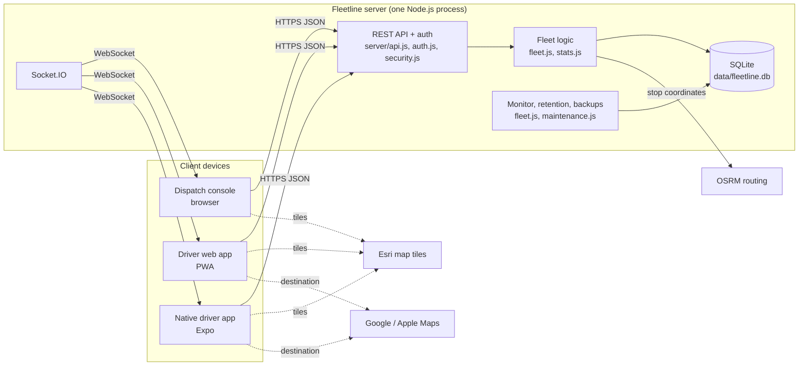

# Fleetline architecture pack

Completed copy of *Full-stack software architecture: reusable template and delivery workflow* (v1.0, 6 October 2026) for **Fleetline**.

| | |
|---|---|
| Pack version | 1.0, 6 October 2026, tracks git commit of the same date |
| Product owner (accountable) | **onichajude** (GitHub account; sole owner and developer at present) |
| Status legend | **Applicable**: met, evidence linked. **Partial**: applicable, some controls pending. **Pending**: decision or control outstanding, with owner and due date. **N/A**: not applicable, with reason. |
| Review | After any change to markets, data, vendors, features or hosting, and at least every 6 months (next: 2027-04-06) |

> **Compliance boundary.** This pack records engineering decisions and evidence. It is not legal advice or certification. Which laws apply depends on the countries Fleetline operates in, which is still undecided (see area 18). A qualified legal or compliance owner must validate applicability before launch.

One person currently holds every role (product, engineering, security, operations). The template asks for independent approval where risk requires it. That's recorded as a pending item for launch (gate G6), not assumed.

---

## 01 Product purpose and boundaries: **Applicable**

| Field | Decision |
|---|---|
| Product | Fleetline: fleet management with live GPS tracking, route planning and dispatch, driver apps, performance and vehicle condition |
| Problem | Dispatchers can't see where vans and trucks are, whether deliveries are on time, or whether vehicles are safe to drive |
| Users | Admins (company owner or manager), dispatchers, drivers (employees or contractors of the operating company) |
| Platforms | Web dispatch console (desktop browser); driver web app (mobile browser, PWA); native driver app (Android, iOS) |
| Operating countries | **Pending**: owner onichajude, due 2026-10-20. Demo data is in Houston, USA |
| Business model | **Pending**: self-hosted for one company, or a hosted service sold to companies (decides area 08). Owner onichajude, due 2026-10-20 |

**Critical journeys** (owner: onichajude):

| Journey | Success condition | Defined failure outcome |
|---|---|---|
| J1 Driver registration and approval | Driver requests account → admin approves with vehicle → driver signs in | Pending or declined accounts cannot sign in (403 with explanation) |
| J2 Shift and tracking | Driver accepts notice → starts shift → GPS reaches dispatch within 10 s | No notice acceptance = no shift and no location collected; offline phone queues fixes, dispatch shows "No signal" after 3 min |
| J3 Plan and dispatch a route | Route with stops saved and pushed to the driver's phone | Invalid stops rejected with nothing saved; busy or in-maintenance vehicles refused |
| J4 Deliver | Stop arrives (geofence or tap) → delivered with note, or skipped with reason → route completes | Wrong driver cannot act on another vehicle's stops (404) |
| J5 Performance review | Driver and admin see the same weekly figures, rank and vehicle condition | Missing history shows "first week" instead of fake averages |
| J6 Account recovery | Admin resets password or two-step login; user changes own password | Every other session is signed out |
| J7 Account deletion (driver leaves) | Admin exports data, then erases personal data | Erasure refused during an open shift; business records kept without identity |

**Out of scope:** payments, customer-facing tracking links, proof-of-delivery photos or signatures, turn-by-turn navigation (handed off to Google or Apple Maps), multi-company tenancy.
**External dependencies:** map tiles (Esri), road routing (OSRM), Expo build service, phone OS location services. See [registers.md](registers.md#vendor-register).
**People who could be harmed:** drivers (location surveillance, unfair rankings, distraction while driving), the public (unsafe vehicles, speeding), the operating company (data breach, wrong delivery records).
**Unacceptable outcomes:** location collected outside a shift or without notice; one driver seeing another's data; a driver being asked to interact with the app while moving; a vehicle with an open safety problem shown as "Good".

## 02 Measurable quality requirements: **Partial**

Targets are set below. **None has been measured under load yet.** A load test and an availability measurement are pending (owner onichajude, before gate G5).

| Requirement | Target | Measurement | Owner |
|---|---|---|---|
| Availability (J2, J3, J4) | 99.5% per calendar month, excluding announced maintenance | Uptime check on `/api/health` every minute (pending hosting) | onichajude |
| GPS end-to-end latency | 95th percentile ≤ 10 s, 99th ≤ 30 s from fix to dispatch map | `received_at - recorded_at` on `positions` | onichajude |
| API latency | p95 ≤ 300 ms, p99 ≤ 1 s for `/api/*` (excluding routing), at the workload below | `ms` field in request logs | onichajude |
| Workload | 50 vehicles, 10 dispatchers, 1 GPS batch per vehicle every 5 s | Load test (pending) | onichajude |
| Storage | Up to 15 GB/year at 50 vehicles × 10 h/day; capped by 180-day position retention | SQLite file size | onichajude |
| Error rate | < 1% of API requests return 5xx per day | Request logs | onichajude |
| Recovery point objective (RPO) | 24 h (daily backup); set `BACKUP_INTERVAL_HOURS=1` for 1 h | Backup timestamps | onichajude |
| Recovery time objective (RTO) | 4 h to restore service on a new host | Restore drill (pending, see runbooks) | onichajude |
| Supported browsers | Current Chrome, Edge, Safari, Firefox (last 2 versions) | Manual test | onichajude |
| Supported phones | Android 10+, iOS 16+ | Device test (pending) | onichajude |
| Accessibility | WCAG 2.2 AA for console and driver apps | Audit pending (area 05) | onichajude |
| Operating budget | ≤ USD 50/month for up to 50 vehicles (hosting, tiles, routing) | Monthly bill | onichajude |
| Support lifetime | 2 years from launch, then reassess | — | onichajude |

Business consequence of missing RTO/RPO: dispatch runs on phone calls; up to one day of deliveries must be re-entered from drivers' notes.

## 03 System structure and architecture decisions: **Applicable**

**Architecture style:** one modular Node.js service (modular monolith) with an embedded SQLite database, serving the REST API, WebSocket updates and both web apps. A separate native driver app talks to the same API. Reasons and alternatives: [ADR-0001](adr/0001-modular-monolith-sqlite.md).

**Trust boundaries:**
- **B1 Internet to server.** All requests are untrusted until authenticated. Role checks run on the server.
- **B2 Server to third parties.** Stop coordinates go to OSRM.
- **B3 Browser to tile host.** The tile host sees the viewer's IP address and map area.
- **B4 Device storage.** Sessions are on the device; the offline GPS queue is on the phone.

| Component | Purpose | Data | Depends on | Scaling and failure behaviour |
|---|---|---|---|---|
| `server/api.js` | HTTP API, input validation | All | auth, fleet, stats, security | Single process; restart restores in-memory state from the DB (`hydrateLive`) |
| `server/auth.js`, `security.js` | Passwords, tokens, two-step login, audit log, privacy notice | Credentials, audit | DB | Login throttles are in memory and reset on restart (accepted, [risk R-05](registers.md#risk-register)) |
| `server/fleet.js` | Live state, GPS intake, geofence, alerts, route lifecycle | Positions, routes | DB, OSRM | OSRM outage: straight-line estimates; GPS intake is idempotent |
| `server/stats.js` | Performance, rankings, vehicle condition | Derived | DB | Computed on request; no derived store to drift |
| `server/maintenance.js` | Retention purge, backups | All | DB, disk | Errors logged; server keeps running |
| Socket.IO | Push updates | Vehicle summaries, routes, alerts | Auth | Clients reconnect; also poll every 20–60 s |
| Native app | Background GPS, offline queue | Own location, session | Expo modules, OS | Queue survives offline (5,000 fixes) |

**Deployment model:** one server process with a persistent disk, behind HTTPS (hosting choice pending, see area 14). **Build vs buy:** see the vendor register. **Decision records:** [adr/](adr/).

## 04 Functionality and business integrity: **Applicable**

**State machines** (enforced in `server/fleet.js` and `server/api.js`):
- **Route:** `draft → dispatched → active → completed`, or `→ cancelled` from draft, dispatched or active. Only draft and dispatched routes can be edited or re-assigned; only drafts can be deleted.
- **Stop:** `pending → arrived → completed`, or `pending | arrived → skipped`. Each change happens only from the expected prior state, so repeated taps are harmless.
- **Account:** `pending → approved | declined`; `active ↔ inactive`; `→ erased` (one-way).
- **Shift:** open → closed; at most one open shift per driver and per vehicle.

**Integrity rules:**
- **Route creation:** creating a route and its stops is a single transaction, after validation ([test](../../backend/test/security.test.js)).
- **Duplicate GPS points:** a unique `(vehicle_id, recorded_at)` key plus `INSERT OR IGNORE` makes re-sent GPS batches harmless, and the odometer only counts saved fixes ([test](../../backend/test/security.test.js)).
- **Erasure:** erasing a driver's data is one transaction.
- **Concurrency:** all writes go through one process with synchronous SQLite, so requests are serialised. Running more than one server process is not supported ([ADR-0001](adr/0001-modular-monolith-sqlite.md)).
- **Messages match records:** a success message is shown only after the database write returns, and stop and route statuses come from server responses.

**Known gap:** creating a route isn't idempotent if a client retries after a timeout. The interface disables the button while saving. Accepted as [risk R-08](registers.md#risk-register).

## 05 User experience, accessibility and localisation: **Partial**

- **Design system:** shared colour and type tokens with light and dark themes (`public/*/style.css`, `mobile/src/theme.ts`).
- **Interface states:** loading, empty, error, permission-denied (location blocked, pending approval) and offline (queued GPS, "No signal") states are designed.
- **Saved work:** toasts confirm saved work; errors say what to do next.
- **Driving safety:** large touch targets (52 px). Arrival and completion are automatic, so drivers need no interaction while moving.
- **Accessibility target:** WCAG 2.2 AA. Labels, roles and visible focus exist, but **no audit or screen-reader test has been done.** Pending, owner onichajude, before G5.
- **Localisation:** English only. Times and dates use the device locale, distances are in km, and there are no currencies. Other languages: **N/A** until a non-English market is chosen (area 01).
- **Offline:** the native app queues GPS. The web driver app queues GPS in browser storage and caches its shell with a service worker. Stop actions need a connection; this is shown as an error.
- **Shared or lost devices:** sign-out is available, and an admin can reset the password, which ends all sessions.

## 06 Identity and authentication: **Applicable**

| Decision | Implementation | Evidence |
|---|---|---|
| Identity provider | Built in (username + password); no SSO | `server/auth.js` |
| Passwords | scrypt with a random salt; at least 8 characters, not equal to the username | `passwordProblem`, tests |
| Two-step login (privileged access) | **Required** for admins and dispatchers (TOTP authenticator app, RFC 6238). Enforced on the server for the API and WebSocket; codes can't be reused | `security.js`, `auth.js`, [security test](../../backend/test/security.test.js) |
| Sessions | JWT (HS256), 14-day expiry, revoked by `token_version` on password change, reset, deactivation, erasure or two-step change | tests |
| Registration | Driver self sign-up stays pending until an admin approves it | api test |
| Recovery | Admin resets the password and/or two-step login (lost phone); every other session ends. No email reset, because there's no verified email channel | runbooks |
| Abuse controls | Login throttle: 8 failures per username + IP per 10 min. Sign-up: 5 per IP per hour. The same message for unknown user and wrong password (no account enumeration) | `auth.js`, `api.js` |
| Service identities | None. The server makes outbound calls only to OSRM, without credentials. `JWT_SECRET` comes from the environment or is generated into `data/` (never committed) | `.gitignore` |
| Deprovisioning | Deactivate (`active=0` ends sessions) or erase | `PATCH /api/drivers/:id`, `/erase` |

**Pending:**
- Two-step login for drivers is not offered (proportionate: drivers can only see their own data). Owner onichajude, review at G5.
- No SSO or automated provisioning. **N/A** until an enterprise customer needs it.

## 07 Permissions and access control: **Applicable**

Roles are admin, dispatcher and driver; checks run on the server for every endpoint. The full matrix is in [permission-matrix.md](permission-matrix.md).
- **Default deny:** every endpoint except sign-in, sign-up, config, health and the privacy notice requires a role.
- **Drivers:** only reach `/api/driver/*`, and only their own shift, vehicle and stops (`ownStop`). Tested: [a driver can't act on another vehicle's stops](../../backend/test/security.test.js).
- **Admin-only actions:** user creation, approvals, password and two-step resets, data export and erasure, audit log, vehicle creation.
- **Separation of duties:** **pending**. There's one admin today; the owner must name a second admin before launch so resets of the first admin are possible. Owner onichajude, due before G6.
- **Access reviews:** quarterly review of staff accounts and the audit log. See [runbooks](runbooks.md#quarterly-access-review).

## 08 Tenant isolation: **N/A for now (pending business-model decision)**

Each deployment serves **one organisation**. Every user of an instance belongs to the same company, so there is no cross-customer data to separate.

**If** the business model becomes a shared hosted service (area 01), this area must be completed before a second customer is onboarded. That means organisation IDs on every table and query, cross-tenant negative tests, quotas and per-tenant deletion. Owner onichajude; due when the business model is decided (2026-10-20).

## 09 Security design and verification: **Partial**

- **Threat model:** [threat-model.md](threat-model.md).
- **Verification baseline:** OWASP ASVS 5.0 Level 2 for the API and web apps. The mapping of key controls is in the [control register](control-register.md). A full ASVS assessment is **pending** (owner onichajude, before G5).
- **In place:**
  - Parameterised SQL everywhere.
  - Input validation and length limits.
  - Escaped HTML output.
  - Content Security Policy, `nosniff`, frame denial, referrer policy, Permissions-Policy, HSTS over HTTPS.
  - `Cache-Control: no-store` on API responses.
  - JSON body limit of 1 MB.
  - Rate limits on sign-in and sign-up.
  - Audit log.
  - Dependency audit in CI (fails on high findings for the backend, critical for mobile).
- **Encryption:** in transit, TLS at the host or proxy (pending hosting). At rest, the host's disk encryption (pending). Phone sessions are in the OS keychain or keystore.
- **Accepted risks:** listed with expiry in the [risk register](registers.md#risk-register). Examples are browser sessions in localStorage (mitigated by CSP), a GPS queue on the phone that isn't encrypted, and Expo build-tool advisories with no fix.
- **Vulnerability reporting:** [SECURITY.md](../../SECURITY.md). Fix critical findings in 7 days and high in 30.
- **Pending:** an independent penetration test before a public or paid launch (owner onichajude, before G6).

## 10 Data ownership, integrity and lifecycle: **Applicable**

The data dictionary, classification, owners and retention are in [data-and-privacy.md](data-and-privacy.md).
- **Primary vs derived:** the SQLite tables are the primary records. Performance and vehicle condition are computed on request (no derived copies). The only copies are backups, exports and data held on the phone.
- **Retention (automatic):** location history 180 days, alerts 365 days, audit log 730 days. Other records are kept for the life of the account. Retention of business records (routes, deliveries, inspections) is **pending** a legal-retention decision (owner onichajude, due 2026-10-31).
- **Deletion:** driver erasure removes personal identifiers and location history and scrubs names from alerts. **Backups keep erased data until they rotate out (14 days by default).** After any restore, re-run the erasures listed in the audit log (`privacy.erase`); see [runbooks](runbooks.md#restore-from-backup).
- **Migrations:** additive and forward-only (`addColumn` in `server/db.js`). Each one is tested by starting the server on an existing database. Take a backup first.

## 11 Privacy operations: **Partial**

- **Processing register, legal basis per purpose, and rights workflows:** see [data-and-privacy.md](data-and-privacy.md).
- **Notice:** drivers must accept the current privacy notice before a shift can start or any location can be collected. Acceptance is recorded with its version and audited, and a change of version requires acceptance again.
- **Only during shifts:** location is collected only during shifts (enforced on the server). No third-party analytics or advertising trackers.
- **Rights:**
  - Access and portability: the driver's own download, or an admin export.
  - Erasure: admin erase.
  - Correction: an admin edits name or phone.
- **Legal basis:** must be confirmed per country. In the EU or UK, employee consent is usually not a valid basis, so legitimate interest or contract would apply and needs an impact assessment. **A privacy impact assessment (DPIA) is pending.** Location tracking of workers is likely to need one. Owner onichajude with a legal adviser, due before G5.
- **Pending:** a data protection officer, processor agreements with vendors that receive personal data (Esri via IP addresses, OSRM via stop coordinates), and international transfer assessment. These depend on area 18.

## 12 Analytics collection and measurement: **Applicable**

- **Business questions:**
  - Are deliveries on time?
  - Which drivers and vehicles need support?
  - Is the fleet used efficiently?
  - Are vehicles safe?
- **Events:** consequential outcomes come from authoritative server records (stop arrival and completion timestamps, GPS fixes), never from button clicks.
- **No product analytics or third-party measurement.** There are therefore no tracking choices or cookies to manage.
- **Metric dictionary** (formula, population, window, owner): see [data-and-privacy.md](data-and-privacy.md#metric-dictionary).
- **Known-input tests:** the seed's fixed random generator produces reproducible history, and tests check leaderboard and profile figures. Deeper reconciliation tests (late, duplicate and missing GPS) are **pending**, owner onichajude, before G5.
- **Retention:** derived figures are recalculated from the primary records, so retention and erasure carry through automatically.

## 13 APIs, integrations and background work: **Applicable**

- **Contract:** the endpoint list is in the [backend README](../../backend/README.md#api-overview); all endpoints use JSON and Bearer authentication.
- **Version policy:** one unversioned `/api`. Changes are additive only. Breaking changes require `/api/v2` and support for the previous native-app version for 90 days ([ADR-0006](adr/0006-api-versioning.md)).
- **Limits:** 1 MB body, 2,000 GPS points per batch, 500 audit entries per page.
- **Timeouts:** OSRM 12 s, with a straight-line fallback; client requests 20 s.
- **Retries:**
  - The GPS queue retries until accepted, which is safe because uploads are idempotent.
  - Stop actions are state-guarded.
  - Route creation is not idempotent ([risk R-08](registers.md#risk-register)).
- **Background jobs:** the late-stop and offline monitor (30 s), retention (12 h) and backups (24 h) run in-process. Each is idempotent; a missed run is caught up by the next.
- **No webhooks or message queues.**

## 14 Infrastructure and software delivery: **Partial**

- **Environments:** local development (`start-local.cmd`) and tests (temporary database per run). **Staging and production hosting are pending.** Options are in [ADR-0007](adr/0007-hosting.md); owner onichajude, due before G6.
- **Configuration and secrets:** environment variables (`backend/.env.example`). Secrets are never committed; `.gitignore` covers `.env`, `data/` and signing keys.
- **Pipeline** ([ci.yml](../../.github/workflows/ci.yml)):
  - Syntax checks
  - 16 end-to-end tests
  - Dependency audit
  - Mobile typecheck and bundle build
- **Pending:** secret scanning (enable GitHub secret scanning / push protection) and branch protection on `main`. Owner onichajude, due 2026-10-13.
- **Dependency inventory:** `package-lock.json` files. Licences: all MIT, Apache-2.0, ISC or BSD (to be confirmed with `npx license-checker` before G6).
- **Rollout and rollback:** deploy a tagged commit, keeping the previous build and the database backup taken just before. Schema changes are additive, so rolling back the code is safe. A forward-only migration would need a forward fix ([runbooks](runbooks.md#deploy-and-roll-back)).
- **Reference:** NIST SSDF practices are followed where they apply (protected repository, reviewed changes, automated tests, vulnerability response).

## 15 Reliability and disaster recovery: **Partial**

| Failure | Behaviour |
|---|---|
| OSRM unavailable | Straight-line routes and estimates; dispatch continues |
| Tile host unavailable or blocked | Map background is blank; vehicles, routes and all functions still work; tiles retry 3 times |
| Phone offline | GPS queued (5,000 fixes) and sent on reconnect; dispatch shows "No signal" after 3 min |
| Server restart | Live state rebuilt from the database; clients reconnect |
| Disk full / database corrupt | `/api/health` returns 503; restore from backup ([runbooks](runbooks.md#restore-from-backup)) |
| Bad release | Roll back the code; restore the database only if a migration damaged data |
| Lost server | Rebuild a host, deploy, restore the latest backup copied off the machine (pending off-site copy) |

- **Backups:** daily, kept for 14 days, and each one verified (integrity check and row counts) ([test](../../backend/test/security.test.js)). **Pending:**
  - Copy backups to separate storage, because a backup on the same disk doesn't survive losing that disk.
  - Encrypt that storage.
  - Run a timed restore drill on the production host to measure the RTO.

  Owner onichajude, before G6.
- **Multiple regions:** **N/A**. The cost and complexity aren't justified at a 99.5% target.

## 16 Observability, audit and incident response: **Partial**

- **Logs:** one JSON line per API request (request ID, method, path without query string, status, duration, user ID). There are no request bodies, tokens or coordinates in logs. Successful GPS uploads aren't logged.
- **Errors:** errors return a reference ID that matches the log line.
- **Health:** `GET /api/health` reports database status and uptime, without authentication or personal data.
- **Business alerts:** in-app alerts with severity (speeding, late, offline, skipped, inspection problems, sign-ups).
- **Audit log:** append-only through the API. It records sign-ins and failures, two-step changes, password changes and resets, approvals, user and vehicle changes, routes, data exports, erasures and retention purges, with actor, target, time, IP and request ID. Admins can view it in Setup → Audit log. Kept 730 days.
- **Pending:**
  - External uptime monitoring and alerting to a person (needs hosting)
  - On-call cover
  - A notification matrix for data breaches by country (needs area 18)

  Owner onichajude, before G6. The incident runbook is in [runbooks.md](runbooks.md#incident-response).

## 17 Testing and release assurance: **Partial**

- **Automated tests (16, all passing):**
  - Sign-in and roles
  - The full delivery cycle with geofencing
  - Password changes and resets
  - Sign-up approval
  - Pre-trip checks and profiles
  - Health, security headers and JSON errors
  - Enforced two-step login and replay protection
  - The audit log
  - The privacy notice gate
  - Idempotent GPS uploads
  - Cross-driver access denial
  - Atomic route creation
  - Retention
  - Export and erasure
  - Backup verification
  - Staff account creation and deactivation
- **Test data:** synthetic seed data only; no real personal data in tests.
- **Mobile:** typecheck and bundle build in CI. **On-device tests of background tracking are pending** (owner onichajude, before G5).
- **Release blockers:**
  - Any failing test
  - A high or critical dependency finding (backend)
  - A critical finding (mobile)
  - An open "significant" threat without an accepted, dated exception
- **Pending:**
  - Load test (area 02)
  - Accessibility audit (area 05)
  - Penetration test (area 09)
  - Restore drill (area 15)

## 18 Legal, standards and contractual applicability: **Pending**

The applicability register, with candidate obligations, is in [registers.md](registers.md#applicability-register). **No market has been chosen, so no obligation can be confirmed or excluded yet.** Owner onichajude, with a qualified legal adviser, due 2026-10-31 and in any case before G1 can pass.

## 19 Specialist product modules: **Applicable**

| Module | Applies? | Reason / controls |
|---|---|---|
| Mobile and offline | **Yes** | Session in keychain/keystore (readable after first unlock for background use); offline GPS queue; signed builds via EAS; device loss → admin resets password/two-step; queue not encrypted ([risk R-03](registers.md#risk-register)) |
| Safety-critical (driving) | **Partly** | Not a vehicle control system, but used while driving: no interaction needed while moving (automatic arrival and completion), large targets, navigation handed off to the phone's maps app. Formal hazard analysis **N/A** (no control over the vehicle) |
| Worker monitoring | **Yes** | Location and performance of workers: notice, shift-only collection, retention, rankings visible to employer (see areas 11, 18) |
| Payments, financial balances | N/A | No payments or money handled |
| Healthcare | N/A | No health data (Midtown Medical Center in demo data is only a delivery address) |
| Children and education | N/A | Drivers are adult workers |
| AI features | N/A | No AI or ML models; rankings are fixed formulas |
| User content and moderation | N/A | Only staff and drivers write short notes; no public content |
| Devices and firmware | N/A | Uses phone OS location; no own hardware |
| Enterprise (SSO, SLAs, audits) | N/A for now | Reopen for the first enterprise customer |

## 20 Administration, support, vendors and cost: **Partial**

- **Administration:** a sensitive surface, admin-only and audited. Erasure requires typing the username, and resets end sessions. Bulk export of all data is limited to backups on the server. There is no impersonation feature.
- **Support model:** **pending**, with a named support contact and escalation path (owner onichajude, before G6). Staff onboarding and offboarding are in [runbooks.md](runbooks.md#staff-onboarding-and-offboarding).
- **Vendors:** see the [vendor register](registers.md#vendor-register). Production licences for map tiles and routing are **pending** (the free public services are for testing only).
- **Cost model and budget alerts:** see [registers.md](registers.md#cost-model). Hosting budget alerts are pending until hosting exists.

## 21 Launch, maintenance and retirement: **Pending**

Fleetline is **not launched**. Launch authority belongs to onichajude, with independent review of security and privacy (named reviewer pending).

The launch checklist is gate G6 in [worksheets.md](worksheets.md#gate-decision-records).

**Maintenance cadence:**
- Dependency updates monthly
- Access review quarterly
- Restore drill twice a year
- Pack review every 6 months

**Retirement plan:** [runbooks.md](runbooks.md#retirement).

## 22 Architecture pack and traceability: **Applicable**

- **Location:** this folder, `docs/architecture/`, versioned in git with the code. Evidence for a release is the commit and the CI run.
- **Traceability:** [control-register.md](control-register.md) maps each control to its requirement, implementation, test and evidence. [worksheets.md](worksheets.md) holds the feature completion records and gate decisions.
- **Exceptions:** recorded in the [risk register](registers.md#risk-register) with an owner, mitigation and expiry.
- **Review owner:** onichajude. Changes go through a pull request that updates the affected sections.
